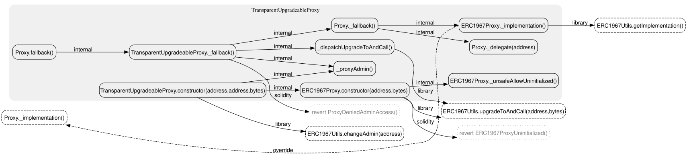
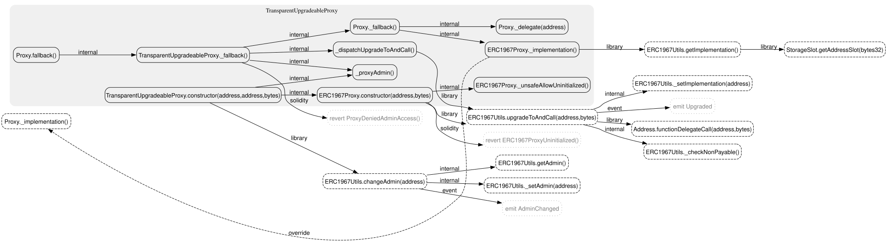

# sol-callgraph

`sol-callgraph` is a focused call graph exporter for Solidity projects. It uses
Slither for Solidity parsing and call resolution, then emits a smaller graph
centered on the file, contract, or function you actually want to inspect.

It is designed for source review, proxy/upgradeability analysis, and building
viewer-friendly graph data. It is not an execution trace, an attack-path finder,
or a blockchain state analyzer.

## Why This Exists

Slither is excellent at understanding Solidity, but its built-in graph printers
are often too broad for day-to-day contract reading. In a real project, a raw
project-wide graph can quickly become noisy:

- too many contracts unrelated to the file under review
- inherited functions mixed with declared functions without enough context
- library calls, proxy paths, modifiers, errors, and builtins competing for
  attention
- output that is useful to Graphviz but awkward for a custom viewer

`sol-callgraph` keeps Slither as the semantic backend, but changes the product
surface:

- choose a focused root scope: target file, specific contract, or specific
  function
- keep important cross-file calls, including library calls such as
  `ERC1967Utils.upgradeToAndCall`
- optionally include inherited members, interfaces, events, errors, constructors,
  override relationships, and clusters
- mark semantic non-execution edges such as overrides separately from real call
  edges
- export DOT/SVG/PNG for humans and JSON for machines/viewers

## Example

The following example analyzes OpenZeppelin's
`TransparentUpgradeableProxy.sol`, including inherited functions and override
relationships while hiding Solidity builtins:

```bash
export OZ_ROOT=/path/to/openzeppelin-contracts

./sol-callgraph "$OZ_ROOT/contracts/proxy/transparent/TransparentUpgradeableProxy.sol" \
  --contract TransparentUpgradeableProxy \
  --depth 1 \
  --include-inherited \
  --include-events \
  --include-overrides \
  --cluster \
  --no-builtins \
  --format svg \
  --out docs/assets/transparent-upgradeable-proxy-depth1.svg
```

Depth 1:



Depth 2 expands one level further from expandable calls:



The same graph can be exported as JSON:

```bash
./sol-callgraph "$OZ_ROOT/contracts/proxy/transparent/TransparentUpgradeableProxy.sol" \
  --contract TransparentUpgradeableProxy \
  --depth 1 \
  --include-inherited \
  --include-events \
  --include-overrides \
  --cluster \
  --no-builtins \
  --format json \
  --out tup.json
```

Example JSON edge metadata:

```json
{
  "src": "contracts/proxy/ERC1967/ERC1967Proxy.sol::ERC1967Proxy::_implementation()",
  "dst": "contracts/proxy/Proxy.sol::Proxy::_implementation()",
  "kind": "override",
  "classes": ["edge-override", "semantic", "non-execution"],
  "style": "dashed",
  "constraint": false,
  "tooltip": "kind: override, non-execution, resolved: yes"
}
```

## Installation

This repository targets Python 3.12+.

```bash
git clone <repo-url>
cd sol-callgraph

python3.12 -m venv .venv
./.venv/bin/python -m pip install -U pip
./.venv/bin/python -m pip install -e ".[dev]"
```

`sol-callgraph` needs Slither available in the Python environment used at
runtime. If Slither is not already available, install it in the same virtual
environment:

```bash
./.venv/bin/python -m pip install slither-analyzer
```

SVG and PNG output require Graphviz's `dot` command:

```bash
brew install graphviz
```

The repository includes a launcher script:

```bash
./sol-callgraph --help
```

If you install the package into an environment, the console script is also
available as:

```bash
sol-callgraph --help
```

## Usage

Generate DOT to stdout:

```bash
./sol-callgraph contracts/MyContract.sol
```

Write SVG to a file:

```bash
./sol-callgraph contracts/MyContract.sol --format svg --out graph.svg
```

Focus on one declaration in a multi-contract file:

```bash
./sol-callgraph contracts/MyContract.sol --contract MyContract
```

Start from one function:

```bash
./sol-callgraph contracts/MyContract.sol \
  --contract MyContract \
  --root-function "transfer(address,uint256)"
```

Include inherited members as roots:

```bash
./sol-callgraph contracts/MyProxy.sol \
  --contract MyProxy \
  --include-inherited \
  --include-overrides \
  --cluster
```

List declarations recognized in a file:

```bash
./sol-callgraph contracts/MyContract.sol --list-contracts
```

Print detected project environment:

```bash
./sol-callgraph contracts/MyContract.sol --print-env
```

### Output Path Behavior

When `--out` is relative, it is resolved against the directory where you invoked
`sol-callgraph`, not against an automatically detected Solidity project root.
This matters when analyzing a contract outside the current repository.

Shell redirection works as usual:

```bash
./sol-callgraph contracts/MyContract.sol > graph.dot
```

## CLI Reference

Current `--help` output:

```text
usage: sol-callgraph [-h] [-c NAME] [--depth N] [-o PATH]
                     [--format {dot,svg,png,json}] [--list-contracts]
                     [--quiet] [-v] [--root PATH] [--no-root-detect]
                     [--print-env] [--include-inherited]
                     [--include-interfaces] [--root-function FUNC]
                     [--include-events] [--no-errors] [--no-builtins]
                     [--no-constructors] [--include-overrides] [--cluster]
                     [--no-cluster] [--max-nodes N] [--max-edges N]
                     [--fail-on-unresolved] [--fail-on-warning]
                     [--slither-arg ARG] [--solc-remaps REMAPS]
                     [--solc-args ARGS] [--compile-force-framework FRAMEWORK]
                     [--debug-slither]
                     [TARGET]

sol-callgraph: A focused call graph exporter for Solidity.

This tool generates concise call graphs centered around a specific Solidity file or contract.
Unlike standard Slither printers, it ensures that critical calls across files, libraries, 
and proxies (like ERC1967) are retained while filtering out project-wide noise.

Environment Management:
  --debug-env              (Launcher only) Print Slither environment info and exit
  --slither-python <path>  (Launcher only) Explicitly set the Python interpreter with Slither installed
  --print-env              Print compilation environment info and exit

positional arguments:
  TARGET                               Target Solidity file

options:
  -h, --help                           show this help message and exit
  -c, --contract NAME                  Focus on specific
                                       contract/library/interface (can be
                                       repeated)
  --depth N                            Depth of call graph expansion (default:
                                       1)
  -o, --out PATH                       Output file path (default: stdout)
  --format {dot,svg,png,json}          Output format (default: dot)
  --list-contracts                     List all recognized contracts/libraries
                                       in the target file and exit
  --quiet                              Suppress non-essential warnings
  -v, --verbose                        Enable detailed diagnostic logging
  --root PATH                          Explicitly specify the Solidity project
                                       root directory
  --no-root-detect                     Disable automatic project root
                                       detection
  --print-env                          Print detected compilation environment
                                       and exit
  --include-inherited                  Include inherited functions/modifiers
                                       in the root scope
  --include-interfaces                 Include interface functions as root
                                       nodes
  --root-function FUNC                 Start the call graph from specific
                                       function names (can be repeated)
  --include-events                     Include event emissions in the graph
  --no-errors                          Hide custom error and revert nodes
  --no-builtins                        Hide Solidity built-in functions (e.g.,
                                       abi.decode, keccak256)
  --no-constructors                    Exclude constructor functions from the
                                       root scope
  --include-overrides                  Include override/overrides
                                       relationships in the graph
  --cluster                            Cluster functions by contract
  --no-cluster                         Disable clustering (default)
  --max-nodes N                        Maximum number of nodes in the graph
                                       (default: 500, 0 for unlimited)
  --max-edges N                        Maximum number of edges in the graph
                                       (default: 1000, 0 for unlimited)
  --fail-on-unresolved                 Exit with non-zero code if there are
                                       unresolved calls
  --fail-on-warning                    Exit with non-zero code if there are
                                       warnings
  --slither-arg ARG                    Pass extra arguments to Slither (can be
                                       repeated)
  --solc-remaps REMAPS                 Pass remappings to solc
  --solc-args ARGS                     Pass extra arguments to solc
  --compile-force-framework FRAMEWORK  Force Slither to use a specific
                                       compilation framework
  --debug-slither                      Show detailed Slither invocation and
                                       environment info
```

## Concepts

### Root Scope

By default, the root scope is the executable declarations in the target file.
Use `--contract` to narrow the graph to one contract, library, or interface.

`--include-inherited` changes root selection. It adds inherited functions and
modifiers to the root set from the selected contract's perspective. It does not
change depth semantics.

### Depth

`--depth` controls how many call-expansion layers are followed from the selected
root nodes.

For example, `--depth 1 --include-inherited` means:

- choose the selected contract's available function set, including inherited
  functions, as roots
- include one layer of calls leaving those roots

It does not mean "only functions declared in the target Solidity file."

### Execution and Semantic Edges

Most edges represent call-like relationships: internal calls, library calls,
modifier calls, builtins, events, errors, or unresolved calls.

Override edges are different. They are semantic inheritance relationships, not
runtime execution flow. When `--include-overrides` is enabled, override edges are
marked as:

```json
{
  "kind": "override",
  "classes": ["edge-override", "semantic", "non-execution"],
  "style": "dashed",
  "constraint": false
}
```

Viewer implementations should avoid treating these as normal execution edges.

### Builtins, Errors, and Events

Display controls are separated because they carry different review value:

- `--no-builtins` hides Solidity builtins such as `abi.decode` and `keccak256`
- `--no-errors` hides custom error and revert leaf nodes
- `--include-events` shows event emissions

Custom errors are often security-relevant, so they are not the same category as
low-level builtins.

## JSON Output

JSON output is intended for tools and future graph viewers.

Top-level fields include:

- `schema_version`
- `target`
- `project_root`
- `tool_version`
- `slither_version`
- `stats`
- `nodes`
- `edges`

Node objects include stable IDs and display metadata:

```json
{
  "id": "contracts/proxy/Proxy.sol::Proxy::_fallback()",
  "label": "Proxy._fallback()",
  "role": "root",
  "classes": ["root", "function", "internal", "inherited"],
  "tooltip": "declared in: Proxy\nviewed as: TransparentUpgradeableProxy\nsignature: _fallback()\nsource: contracts/proxy/Proxy.sol\nvisibility: internal\nclasses: root, function, internal, inherited",
  "contract": "TransparentUpgradeableProxy",
  "contract_kind": "contract",
  "visibility": "internal",
  "signature": "_fallback()"
}
```

Edge objects include graph semantics and viewer-ready rendering hints:

```json
{
  "src": "contracts/proxy/transparent/TransparentUpgradeableProxy.sol::TransparentUpgradeableProxy::_dispatchUpgradeToAndCall()",
  "dst": "contracts/proxy/ERC1967/ERC1967Utils.sol::ERC1967Utils::upgradeToAndCall(address,bytes)",
  "kind": "library",
  "classes": ["edge-library"],
  "style": "solid",
  "constraint": true,
  "tooltip": "kind: library, resolved: yes"
}
```

## Project Root Detection

`sol-callgraph` automatically detects Solidity project roots so Slither can
resolve imports correctly. Strong markers include:

- `foundry.toml`
- `hardhat.config.*`
- `truffle-config.js`
- `brownie-config.yaml`
- `ape-config.yaml`
- `dapp.json`

Weak markers include:

- `remappings.txt`
- `package.json`
- `.git`

Use `--root <path>` when auto-detection chooses the wrong directory. Use
`--no-root-detect` for standalone files or debugging.

## Development and Testing

The project expects a local `.venv` during development:

```bash
./.venv/bin/python -m pip install -e ".[dev]"
```

Run the normal test suite:

```bash
make test
```

Run the OpenZeppelin self-test:

```bash
make test-selftest-oz
```

Run everything:

```bash
make test-all
```

### OpenZeppelin Test Fixture

The OpenZeppelin tests intentionally use a real external Solidity project. The
repository expects this symlink:

```text
external/openzeppelin-contracts -> /Users/z/Documents/github/openzeppelin-contracts
```

Create it locally if you want to run the OpenZeppelin smoke/self tests:

```bash
mkdir -p external
ln -s /Users/z/Documents/github/openzeppelin-contracts external/openzeppelin-contracts
```

The symlink is ignored by git. OpenZeppelin source code should not be copied into
this repository and should not be committed.

Generated self-test reports are written under:

```text
test-artifacts/openzeppelin-selftest/
```

`test-artifacts/` is also ignored by git.

## Troubleshooting

### Slither is not found

Check the launcher environment:

```bash
./sol-callgraph --debug-env
```

Or force the Python interpreter that has Slither installed:

```bash
./sol-callgraph --slither-python ./.venv/bin/python contracts/MyContract.sol
```

### Imports do not resolve

Print the detected compilation environment:

```bash
./sol-callgraph contracts/MyContract.sol --print-env
```

If the root is wrong, pass it explicitly:

```bash
./sol-callgraph contracts/MyContract.sol --root /path/to/project
```

### SVG or PNG output fails

Install Graphviz:

```bash
brew install graphviz
```

DOT and JSON output do not require Graphviz.

### Interface-only files return no root

Interface declarations usually have no executable function bodies. By default,
they are not root functions. Use `--include-interfaces` if you want interface
functions represented as leaf nodes.

## Limitations

`sol-callgraph` is a static source graph exporter. It does not:

- prove runtime reachability
- model blockchain state
- evaluate access-control conditions
- resolve dynamic low-level call targets precisely
- replace manual security review

Treat the output as a source-reading aid, not as proof of behavior.
