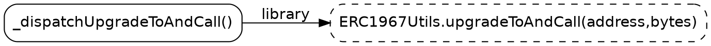

# sol-callgraph 需求与详细设计

## 1. 文档目的

本文档定义 `sol-callgraph` 第一版的需求、命令行行为、核心算法、错误处理和验证标准。

本文档必须自包含。后续即使删除 `project_background` 目录，编程 AI 也应能只依据本文档完成实现。

## 2. 背景与问题

`sol-callgraph` 是一个面向 Solidity 代码的 focused call graph 导出工具。

项目起因是 Slither 原生单合约 call graph DOT 在某些场景下会漏掉跨 contract 或 library 的关键调用。例如在 OpenZeppelin 的 `TransparentUpgradeableProxy._dispatchUpgradeToAndCall()` 中，源码实际包含：

```solidity
function _dispatchUpgradeToAndCall() private {
    (address newImplementation, bytes memory data) = abi.decode(msg.data[4:], (address, bytes));
    ERC1967Utils.upgradeToAndCall(newImplementation, data);
}
```

Slither 原生单合约 call graph 可能只输出：

```text
TransparentUpgradeableProxy._dispatchUpgradeToAndCall()
  -> abi.decode()
```

却漏掉：

```text
TransparentUpgradeableProxy._dispatchUpgradeToAndCall()
  -> ERC1967Utils.upgradeToAndCall(address,bytes)
```

这个遗漏不是边缘噪音，而是代理升级路径中的核心调用。

验证结论是：Slither 底层模型并没有漏识别该调用。`slithir`、Slither Python API 和 `all_contracts.call-graph.dot` 中都能看到这条边。问题主要出在 Slither 原生单合约 call graph printer 的输出范围和裁剪方式上。

因此 `sol-callgraph` 不应裁剪 Slither 生成的全量 DOT，而应直接读取 Slither Python API，从内部模型重新导出 focused graph。

## 3. 产品目标

`sol-callgraph` 的目标是生成围绕目标 Solidity 文件或目标声明的简洁 call graph，同时不丢失关键调用边。

第一版必须满足：

1. 默认以目标 Solidity 文件为 root scope。
2. 支持通过参数指定一个或多个目标 contract/library/interface 声明作为 root scope。
3. 默认输出标准 DOT 到 stdout。
4. 诊断、warning、错误和 verbose 日志输出到 stderr。
5. 不输出 Slither `all_contracts` 那种全项目大图。
6. 不遗漏 Slither API 可识别的 internal、solidity、high-level、library、low-level 调用。
7. 目标 scope 外的可解析函数保留为外部节点。
8. 输出结果可被 Graphviz、脚本或其他工具继续消费。

## 4. 非目标

第一版不追求：

1. 替代 Slither 的全部 call graph 功能。
2. 做全项目完整图谱浏览器。
3. 做交互式审计 UI。
4. 根据业务语义自动高亮函数，例如 `upgrade`、`vault`、`oracle`、`swap` 等。
5. 自动判断漏洞或风险等级。
6. 支持复杂的模糊函数名匹配。

工具只表达结构事实：谁调用谁、调用类型是什么、节点是否属于 root scope、目标是否可继续展开。

## 5. 核心心智模型

`sol-callgraph file.sol` 的含义是：

```text
以 file.sol 中的可执行声明为 root，导出 focused call graph。
```

它不是：

```text
整个项目的 call graph。
```

也不是：

```text
某一个合约的孤立 call graph。
```

默认行为应给用户一个能看的局部结构。需要进一步深挖时，用户再显式使用 `--contract`、`--depth` 或未来的 `--root-function`。

## 6. 第一版 CLI 规格

命令形式：

```bash
sol-callgraph <target.sol> [options]
```

例外：

```text
--debug-env 不需要 target.sol。
```

核心参数：

```text
-c, --contract <name>      只把指定声明作为 root，可重复
--depth <n>                从 root function 向外展开的调用深度，默认 1，必须 >= 1
-o, --out <path>           输出文件，默认 stdout
--format dot|svg|png       输出格式，默认 dot
--list-contracts           列出 Slither 在目标文件中识别到的声明后退出
--quiet                    不输出非必要 warning
-v, --verbose              输出诊断信息
--debug-env                输出 Slither 环境探测结果后退出
--slither-python <path>    手动指定能 import slither 的 Python 解释器
```

第一版可以暂缓但应预留设计空间的参数：

```text
--root-function <canonical-name>    只从指定函数开始画，可重复
--include-interfaces                默认 file scope 不把 interface 函数作为 root；该参数用于显式包含
--include-events                    是否显示 event emit，默认可以关闭或显示为 dotted leaf
--include-errors                    是否显示 custom error/revert，默认开启 dotted leaf
--include-builtins                  是否显示 abi.decode/require/assert 等，默认开启 dotted leaf
--no-cluster                        未来如果按声明分 cluster，可用该参数关闭
--fail-on-warning                   warning 视为失败，供 CI 使用
```

除非本文件后续明确要求，第一版只需要实现核心参数。

## 7. stdout、stderr 与退出码

stdout 只输出最终产物：

```text
--format dot 时输出 DOT
--format svg 时输出 SVG
--format png 时输出 PNG 二进制
--list-contracts 时输出声明列表
--debug-env 时输出环境信息
```

stderr 输出：

```text
warning
error
verbose 日志
Slither/solc 解析诊断
Graphviz 调用错误
scope 选择提示
```

这样用户可以安全执行：

```bash
sol-callgraph My.sol | dot -Tsvg > graph.svg
```

退出码：

```text
0  成功
1  参数错误
2  Slither/solc 解析失败，或找不到可用 Slither 环境
3  找不到目标文件、目标声明或 root function
4  输出文件写入失败
5  Graphviz 执行失败
```

不要在失败时输出空图并返回成功。

## 8. Root Scope 规则

### 8.1 默认 file scope

执行：

```bash
sol-callgraph My.sol
```

含义：

```text
root scope = My.sol 中声明的 contract/library 的有函数体函数与 modifier。
```

默认包含：

```text
contract 中有实现的 function
library 中有实现的 function
modifier
constructor
fallback
receive
```

默认不把 interface 函数作为 root，因为 interface 函数通常没有函数体，放进 root 会产生大量没有 outgoing edge 的死节点。

abstract contract 中：

```text
有函数体的函数可以作为 root。
没有函数体的抽象函数不作为 root。
```

### 8.2 contract scope

执行：

```bash
sol-callgraph My.sol --contract Foo
sol-callgraph My.sol --contract Foo --contract Bar
```

含义：

```text
root scope = 指定声明中的有函数体函数与 modifier。
```

`--contract` 名称虽然沿用常见 CLI 叫法，但匹配对象包括 Solidity 的：

```text
contract
library
interface
abstract contract
```

实现时变量名可以使用 `declaration`，避免把 library/interface 误认为普通 contract。

### 8.3 多声明文件默认行为

如果目标文件中有多个声明，不应报错。

例如：

```solidity
interface IERC20 { ... }
library SafeTransferLib { ... }
contract Vault { ... }
```

执行：

```bash
sol-callgraph Vault.sol
```

默认使用目标文件中所有符合 root 规则的 contract/library/abstract contract 函数与 modifier。

如果未开启 `--quiet`，可向 stderr 输出轻量 warning：

```text
warning: multiple declarations found in Vault.sol: IERC20(interface), SafeTransferLib(library), Vault(contract)
warning: using all executable declarations in target file as root scope; use --contract Vault to narrow it
```

### 8.4 无 root 的处理

如果 root scope 为空，必须报错并返回 exit 3。

示例：

```text
error: no root functions found for contract VaultV2 in My.sol

available declarations:
  Vault       contract
  VaultV1     contract
  SafeLib     library
```

## 9. Slither 声明类型识别

Slither 的 `sl.contracts` 中会同时包含 Solidity 的 contract、library、interface 等声明对象。它们通常不是不同 Python 类，而是同类对象上的属性不同。

实现应提供类似逻辑：

```text
如果 declaration.is_library 为真，kind = library
否则如果 declaration.is_interface 为真，kind = interface
否则如果 declaration.is_abstract 为真，kind = abstract contract
否则 kind = contract
```

该 kind 用于：

```text
--list-contracts 输出
warning 文案
节点 metadata
未来 cluster label
```

不要把所有声明都显示成 contract。

## 10. 调用来源字段

对每个需要展开的 Slither function/modifier，读取以下字段：

```text
function.internal_calls
function.solidity_calls
function.high_level_calls
function.library_calls
function.low_level_calls
```

统一转换为：

```text
src canonical name
dst canonical name 或 call string
kind
dst function object，如果 Slither 可解析
```

需要注意：

1. `high_level_calls` 中的元素通常是 `(contract, operation)`。
2. 如果 `operation.function` 存在，应使用该真实函数作为目标。
3. library call 通常也会同时出现在 `high_level_calls` 中。
4. 同一 `(src, dst)` 需要去重。

## 11. 边类型与去重

边标签表达调用类型。

第一版支持：

```text
internal
solidity
high_level
library
low_level
modifier
```

如果同一 `(src, dst)` 被多个 Slither 字段记录，只保留一个 kind。

优先级：

```text
low_level
library
high_level
internal
solidity
modifier
```

说明：

1. `low_level` 对安全阅读最敏感，例如 `call`、`delegatecall`、`staticcall`，优先显示。
2. `library` 比 `high_level` 更具体。
3. `modifier` 来自函数声明对 modifier 的使用关系，不来自上述五个 Slither 调用字段。

## 12. Modifier 处理

modifier 不是装饰信息，而是 Solidity 安全语义的一部分。

第一版默认显示 modifier：

```text
函数 -> modifier，edge label = modifier
modifier 本身作为 root 或 expandable 节点参与图
modifier 内部调用按普通函数逻辑继续收集
```

示例：

```dot
"Vault.withdraw()" -> "Ownable.onlyOwner()" [label="modifier"];
```

如果 modifier 属于目标 scope，它是 root 节点。如果 modifier 来自外部声明且可解析，则是 expandable 节点。

## 13. Depth 展开模型

默认：

```text
--depth 1
```

含义：

```text
root functions 位于 depth 0。
导出 depth 0 节点发出的边。
如果目标函数可解析，作为 depth 1 节点出现。
不继续展开 depth 1 节点。
```

`--depth 2` 含义：

```text
root functions 位于 depth 0。
导出 depth 0 节点发出的边。
将可解析的 depth 1 目标继续展开。
导出 depth 1 节点发出的边。
不继续展开 depth 2 节点。
```

推广到 `--depth N` 时，使用受限 BFS：

```text
queue = root_functions
function_depth[root] = 0

while queue is not empty:
    f = queue.pop(0)
    if function_depth[f] >= depth:
        continue

    emit outgoing edges from f

    for each dst function:
        if dst is expandable and not seen:
            function_depth[dst] = function_depth[f] + 1
            queue.append(dst)
```

只有具备以下字段的对象才可展开：

```text
internal_calls
solidity_calls
high_level_calls
library_calls
low_level_calls
```

这可以避免把 custom error、event、Solidity builtin 等不可展开对象误当成函数继续展开。

`depth > 1` 会有意引入目标文件或目标声明外部的函数边。这是预期行为，不是噪音。

## 14. 节点分类

节点样式只表达通用结构事实，不表达业务语义。

第一版节点分类：

```text
root
  属于 root scope 的函数或 modifier。
  DOT 样式：solid rounded box。

expandable
  Slither 能解析、但不属于 root scope 的函数或 modifier。
  DOT 样式：rounded dashed box。

builtin-like
  Solidity builtin、custom error、revert、event 等不可继续展开目标。
  DOT 样式：rounded dotted gray box。

unresolved
  无可展开函数对象，且无法明确识别为 builtin-like 的目标。
  DOT 样式：rounded dashed gray box。
```

节点 label 规则：

```text
root 节点可以显示短名，例如 _fallback()
external/expandable 节点显示 canonical name，例如 ERC1967Utils.upgradeToAndCall(address,bytes)
builtin-like 节点显示 Slither 提供的调用字符串，例如 abi.decode()
```

建议在 DOT attribute 中保留 metadata：

```dot
"ERC1967Utils.upgradeToAndCall(address,bytes)" [
  label="ERC1967Utils.upgradeToAndCall(address,bytes)",
  style="rounded,dashed",
  class="expandable library function"
];
```

metadata 不应影响第一版图形阅读，但方便未来生成交互式 SVG 或 HTML。

## 15. DOT 输出要求

DOT 必须是标准 Graphviz DOT。

基础结构：



必须实现 DOT 字符串 escape，不要用 HTML escape 代替 DOT escape。

DOT 字符串 escape 至少处理：

```text
\  -> \\
"  -> \"
换行 -> \n
```

输出文件写入必须使用 UTF-8。

## 16. 输出格式

默认：

```bash
sol-callgraph My.sol
```

输出 DOT 到 stdout。

指定输出文件：

```bash
sol-callgraph My.sol -o graph.dot
```

指定 SVG：

```bash
sol-callgraph My.sol --format svg > graph.svg
sol-callgraph My.sol --format svg -o graph.svg
```

指定 PNG：

```bash
sol-callgraph My.sol --format png -o graph.png
```

`--format dot` 不依赖 Graphviz。

`--format svg` 和 `--format png` 可以通过系统 `dot` 命令实现。实现必须处理：

```text
dot not found
dot 返回非 0
dot stdout/stderr
输出文件写入失败
```

Graphviz 失败返回 exit 5。

## 17. 开发虚拟环境

本项目的开发和测试必须使用当前项目目录下的 Python 虚拟环境：

```text
.venv/
```

当前约定：

```text
.venv 使用 Python 3.12。
.venv 用于安装 sol-callgraph 的开发依赖和测试依赖。
.venv 不要求安装 slither。
Slither 仍由 launcher 从 PATH 中的 slither 命令推断其所属 Python。
```

也就是说，本项目有两个不同职责的 Python 环境：

```text
项目 .venv
  用于运行 pytest、安装本项目 editable 包、运行开发脚本。

Slither Python
  由 Homebrew、pipx、venv 或其他方式安装 slither 时提供。
  用于执行真正需要 import slither 的 core 逻辑。
```

开发和测试命令必须优先使用：

```bash
./.venv/bin/python -m pip install -e ".[dev]"
./.venv/bin/python -m pytest
./.venv/bin/python -m pytest tests/openzeppelin
./.venv/bin/python -m sol_callgraph.selftest_openzeppelin
```

如果 shell 已经激活 `.venv`，可以使用简写：

```bash
python -m pytest
python -m sol_callgraph.selftest_openzeppelin
```

但文档、脚本和最终报告中应优先写出 `./.venv/bin/python -m ...`，避免自动编码工具误用系统 Python。

禁止要求用户把 Slither 安装进 `.venv` 才能运行工具。`.venv` 可以安装 `pytest` 等开发依赖，但 Slither 的发现和执行仍按第 18 节的 launcher 机制处理。

## 18. Slither 环境发现

正式工具不能要求用户这样运行：

```bash
/opt/homebrew/Cellar/slither-analyzer/0.11.5_4/libexec/bin/python sol-callgraph ...
```

Homebrew Cellar 路径包含版本号，升级后会变化。用户应只运行：

```bash
sol-callgraph My.sol
```

### 18.1 架构

工具分为 launcher 与 core：

```text
launcher
  不 import slither
  负责找到可 import slither 的 Python
  用该 Python 执行 core

core
  import slither
  解析 CLI 参数
  构建 Slither 模型
  导出 graph
```

建议目录结构：

```text
src/
  sol_callgraph/
    __init__.py
    launcher.py
    core.py
    slither_env.py
    graph.py
    dot.py
    cli.py
```

入口点：

```toml
[project.scripts]
sol-callgraph = "sol_callgraph.launcher:main"
```

### 18.2 默认探测流程

launcher 默认流程：

```text
1. 在 PATH 中查找 slither。
2. resolve slither 可执行文件，处理 symlink。
3. 读取 slither 脚本第一行 shebang。
4. 从 shebang 推断 Python 解释器。
5. 如果 shebang 是 /usr/bin/env python3，继续用 PATH 解析 python3。
6. 使用该 Python 执行 core。
```

如果用户传入：

```bash
--slither-python /path/to/python
```

则跳过自动探测，直接使用该解释器执行 core。

### 18.3 debug-env

执行：

```bash
sol-callgraph --debug-env
```

输出到 stdout：

```text
slither: /opt/homebrew/bin/slither
resolved slither: /opt/homebrew/Cellar/slither-analyzer/0.11.5_4/bin/slither
slither python: /opt/homebrew/Cellar/slither-analyzer/0.11.5_4/libexec/bin/python
```

如果探测失败，输出 error 到 stderr 并返回 exit 2。

## 19. `--list-contracts`

执行：

```bash
sol-callgraph My.sol --list-contracts
```

stdout 输出 Slither 在目标文件中识别到的声明：

```text
IERC20                         interface
SafeTransferLib                library
Vault                          contract
```

该命令不输出 DOT。

如果 Slither 解析失败，返回 exit 2。

如果目标文件不存在，返回 exit 3。

## 20. 错误与 Warning

必须报错的情况：

```text
target 文件不存在
--depth < 1
--format 不是 dot/svg/png
指定 --contract 但目标文件中不存在该声明
root scope 为空
Slither/solc 解析失败
找不到 slither 或无法推断 Slither Python
Graphviz 失败
输出文件无法写入
```

warning 示例：

```text
multiple declarations found，默认使用文件级 root scope
存在 unresolved call
depth > 1 导致展开外部声明
Graphviz 可选功能不可用，但当前 format=dot 不受影响
```

`--quiet` 抑制 warning，但不抑制 error。

`--verbose` 输出诊断，例如：

```text
target path
Slither Python
root declarations
root function count
edge count
unresolved call count
Graphviz command
```

## 21. 最小实现模块划分

建议保持实现直接，不引入不必要框架。

### 21.1 `launcher.py`

职责：

```text
解析 launcher 层参数：--slither-python、--debug-env
寻找 Slither Python
执行 core
返回 core 的退出码
```

不得 import `slither`。

### 21.2 `slither_env.py`

职责：

```text
find_slither_bin()
resolve_slither_executable()
infer_python_from_shebang()
validate_slither_python()
debug_env()
```

### 21.3 `cli.py`

职责：

```text
定义 core CLI 参数
验证参数
把参数转换成内部 config
```

### 21.4 `graph.py`

职责：

```text
使用 Slither API 构建 root functions
收集调用边
处理 modifier 边
执行 depth BFS
分类节点
统计 warning 信息
```

### 21.5 `dot.py`

职责：

```text
DOT id/string escape
节点 attribute 渲染
边 attribute 渲染
完整 DOT 文本渲染
```

### 21.6 `core.py`

职责：

```text
主流程编排
调用 Slither
调用 graph 构建
调用 DOT 或 Graphviz 输出
统一错误处理
```

## 22. 测试策略与智能自测

`sol-callgraph` 的测试不能只依赖少量手写样例。这个工具的核心风险来自真实 Solidity 项目中的复杂语法、继承、library 调用、modifier、interface、abstract contract、低级调用和 Slither 版本差异。

第一版测试应同时包含：

```text
单元测试
  验证内部纯逻辑，定位快，失败原因明确。

小型 fixture 集成测试
  使用仓库内可控 Solidity 样例，覆盖特定边界。

OpenZeppelin 真实项目功能测试
  使用 /Users/z/Documents/github/openzeppelin-contracts 作为主要真实项目样本。

AI 智能自测
  由编程 AI 或测试脚本自动扫描真实项目，选择代表性合约，运行工具并生成测试报告。
```

结论：不应在“单元测试”和“真实功能测试”之间二选一。单元测试保证工具内部规则不漂移，真实项目功能测试保证工具在正式 Solidity 项目中可用。

### 22.1 单元测试范围

单元测试应覆盖不依赖 Slither 大项目解析的纯逻辑。

必须覆盖：

```text
DOT id/string escape
节点分类：root、expandable、builtin-like、unresolved
边类型优先级与去重
depth BFS 截断逻辑
declaration kind 判断：contract、library、interface、abstract contract
root function 过滤：有函数体、无函数体、interface 默认排除
stdout/stderr 输出策略的可测试封装
错误码映射
launcher shebang 解析
```

这些测试可以使用轻量 fake object，不需要每个测试都启动 Slither。

### 22.2 小型 fixture 集成测试

仓库应保留一组小型 Solidity fixture，用于稳定覆盖具体边界。fixture 不替代 OpenZeppelin 测试，而是让失败更容易定位。

建议 fixture 类型：

```text
单 contract 内部调用
contract 调 library
contract 调 interface
modifier 调用与 modifier 内部调用
constructor/fallback/receive
abstract contract 中有实现和无实现的函数
custom error / revert
event emit
low-level call / delegatecall / staticcall
多声明文件：interface + library + contract
函数重载
```

fixture 测试应断言具体边存在或不存在，不建议只断言命令成功。

### 22.3 OpenZeppelin 真实项目功能测试

真实项目测试基于：

```text
/Users/z/Documents/github/openzeppelin-contracts
```

实现时应把该路径作为本机默认测试路径，但不要硬编码为唯一可用路径。建议支持环境变量：

```text
OZ_CONTRACTS_DIR=/Users/z/Documents/github/openzeppelin-contracts
```

如果环境变量未设置，则测试脚本可以尝试默认路径。如果路径不存在，真实项目测试应跳过并给出明确说明；不能静默成功。

OpenZeppelin 测试的目的不是验证 OpenZeppelin 正确，而是验证 `sol-callgraph` 能在大型、真实、复杂、经常被审计的 Solidity 项目上稳定工作。

### 22.4 OpenZeppelin 固定回归样本

至少保留一组固定样本，作为每次回归必跑集合。

建议样本：

```text
contracts/proxy/transparent/TransparentUpgradeableProxy.sol
  目标：覆盖 proxy、fallback、abi.decode、library call、跨文件调用。
  关键断言：
    _dispatchUpgradeToAndCall -> ERC1967Utils.upgradeToAndCall(address,bytes) [library]
    _dispatchUpgradeToAndCall -> abi.decode() [solidity]

contracts/proxy/ERC1967/ERC1967Utils.sol
  目标：覆盖 library root、internal 调用、custom error/revert、delegatecall 链路。

contracts/proxy/Clones.sol
  目标：覆盖 library、内联汇编附近的 Slither 表达、低级创建/调用相关路径。

contracts/token/ERC20/ERC20.sol
  目标：覆盖经典 token 合约、继承、内部模板方法调用、event emit。

contracts/token/ERC20/utils/SafeERC20.sol
  目标：覆盖 library、interface 调用、低级 call 包装。

contracts/token/ERC721/ERC721.sol
  目标：覆盖继承、receiver interface、高层外部调用、event。

contracts/token/ERC1155/ERC1155.sol
  目标：覆盖 batch 操作、receiver hook、高层调用。

contracts/access/Ownable.sol
  目标：覆盖 modifier、custom error、权限路径。

contracts/access/AccessControl.sol
  目标：覆盖 modifier、角色检查、继承。

contracts/governance/Governor.sol
  目标：覆盖大型 abstract contract、多继承、复杂 internal 调用。
```

如果某个样本路径因 OpenZeppelin 版本变化不存在，测试报告必须说明缺失样本，而不是悄悄忽略。

### 22.5 OpenZeppelin 自动样本发现

为了减少人工枚举，智能自测应自动扫描：

```text
contracts/**/*.sol
```

并按特征选择样本。

建议扫描特征：

```text
包含 library 声明
包含 interface 声明
包含 abstract contract 声明
包含 modifier
包含 constructor
包含 fallback 或 receive
包含 delegatecall/call/staticcall
包含 emit
包含 error 声明或 revert
包含 assembly
包含多个顶层声明
文件路径属于 proxy/token/access/governance/utils/mocks
```

每类至少选择若干个文件。为了测试稳定，自动选择结果应写入测试报告；是否固化为 manifest 由后续实现决定。

### 22.6 AI 智能自测工作流

智能自测是给编程 AI 使用的测试任务，不要求用户手动判断每张图。

建议工作流：

```text
1. 确认 OZ_CONTRACTS_DIR 或默认 OpenZeppelin 路径存在。
2. 扫描 contracts/**/*.sol。
3. 识别每个文件的静态特征。
4. 选择固定回归样本 + 自动发现样本。
5. 对每个样本运行 --list-contracts。
6. 对每个样本运行 --depth 1 --format dot。
7. 对核心样本运行 --depth 2 --format dot。
8. 对少量样本运行 --format svg 和 --format png。
9. 用 Graphviz 解析 DOT，确认 DOT 合法。
10. 检查 stdout/stderr 隔离。
11. 检查关键边断言。
12. 统计节点数、边数、unresolved call 数、warning 数。
13. 生成自测报告。
```

自测报告至少包含：

```text
测试时间
sol-callgraph 版本或当前命令路径
Slither 版本
OpenZeppelin 路径
OpenZeppelin git commit，如果可获得
样本文件列表
每个样本的命令、退出码、节点数、边数、warning 数
关键边断言结果
失败样本详情
跳过原因
```

报告可以输出为 Markdown，例如：

```text
test-artifacts/openzeppelin-selftest/report.md
```

测试产物可以输出到：

```text
test-artifacts/openzeppelin-selftest/
```

该目录是否纳入版本控制由后续实现决定；通常报告和大型图产物不应默认提交。

### 22.7 智能自测通过标准

一次 OpenZeppelin 智能自测通过必须满足：

```text
固定回归样本全部执行成功，除非报告明确说明样本文件不存在。
所有生成的 DOT 都能被 Graphviz 解析。
stdout 中没有 warning/error 污染。
stderr 中没有未解释的 traceback。
TransparentUpgradeableProxy 关键 library 边存在。
depth 2 样本比 depth 1 至少能展开部分外部可解析节点，除非报告解释原因。
--list-contracts 对多声明文件能输出 declaration kind。
--format svg/png 在 Graphviz 存在时成功；Graphviz 不存在时返回正确错误码。
```

不建议把完整 DOT 文本作为大规模 golden snapshot。Slither 版本、OpenZeppelin 版本或 Graphviz 排序变化都可能导致无意义 diff。

更稳定的断言方式：

```text
关键边存在
关键节点存在
节点分类符合预期
边 label 符合预期
节点数/边数在合理范围内
unresolved call 数量不突然大幅增加
命令退出码符合预期
```

### 22.8 测试执行建议

建议提供三档测试命令：

```text
快速测试
  单元测试 + 小型 fixture。
  适合每次编辑后运行。

标准测试
  快速测试 + OpenZeppelin 固定回归样本。
  适合提交前运行。

智能自测
  标准测试 + OpenZeppelin 自动样本发现 + 报告。
  适合功能完成后、重构后、升级 Slither 后运行。
```

智能自测不应要求用户手工打开每个 DOT/SVG。用户只需要看报告中的失败、warning 增量和关键边断言。

### 22.9 测试结论记录

每次重要实现完成后，编程 AI 应在回复中明确说明：

```text
运行了哪一档测试
OpenZeppelin 项目路径是什么
固定样本是否全部通过
自动发现样本数量
关键边断言是否通过
哪些测试未运行，以及原因
```

不要写“已充分测试”这类无法验证的描述。

## 23. 验证要求

第一版实现后至少验证以下场景。

### 23.1 CLI 输出隔离

命令：

```bash
sol-callgraph My.sol > graph.dot
```

验证：

```text
graph.dot 中只有 DOT 内容。
warning/error 不进入 graph.dot。
```

### 23.2 OpenZeppelin proxy 关键边

对包含 `TransparentUpgradeableProxy._dispatchUpgradeToAndCall()` 的目标文件执行：

```bash
sol-callgraph TransparentUpgradeableProxy.sol --contract TransparentUpgradeableProxy --depth 1
```

DOT 必须包含：

```dot
"TransparentUpgradeableProxy._dispatchUpgradeToAndCall()" -> "ERC1967Utils.upgradeToAndCall(address,bytes)" [label="library"];
"TransparentUpgradeableProxy._dispatchUpgradeToAndCall()" -> "abi.decode()" [label="solidity"];
```

### 23.3 depth 2 展开

执行：

```bash
sol-callgraph TransparentUpgradeableProxy.sol --contract TransparentUpgradeableProxy --depth 2
```

DOT 应额外包含类似边：

```dot
"ERC1967Utils.upgradeToAndCall(address,bytes)" -> "ERC1967Utils._setImplementation(address)" [label="internal"];
"ERC1967Utils.upgradeToAndCall(address,bytes)" -> "Address.functionDelegateCall(address,bytes)" [label="library"];
```

### 23.4 多声明文件

给定文件中包含 interface、library、contract。

执行：

```bash
sol-callgraph Vault.sol
```

验证：

```text
不要求用户指定 --contract。
默认 root 包含 contract/library 中有函数体的函数与 modifier。
interface 函数默认不作为 root。
stderr 可输出多声明 warning。
```

### 23.5 指定不存在声明

执行：

```bash
sol-callgraph Vault.sol --contract DoesNotExist
```

验证：

```text
返回 exit 3。
stderr 包含 available declarations。
stdout 不输出 DOT。
```

### 23.6 DOT escape

构造包含引号、反斜杠或换行的 label。

验证：

```text
生成 DOT 可被 dot 解析。
label 显示合理。
```

### 23.7 Slither 环境

在当前 Python 不能 `import slither`，但 PATH 中存在 `slither` 的环境中执行：

```bash
sol-callgraph --debug-env
```

验证：

```text
能显示 slither 路径、resolve 后路径、推断出的 Python。
普通 sol-callgraph 命令能通过该 Python 执行 core。
```

### 23.8 SVG/PNG 输出

执行：

```bash
sol-callgraph My.sol --format svg -o graph.svg
sol-callgraph My.sol --format png -o graph.png
```

验证：

```text
系统存在 dot 时，能生成对应文件。
系统不存在 dot 时，返回 exit 5。
Graphviz 诊断输出到 stderr。
stdout 不混入 warning/error。
```

## 24. 第一版完成标准

满足以下条件即可认为 v0.1 完成：

1. `sol-callgraph <target.sol>` 默认输出 focused DOT 到 stdout。
2. 支持 `--contract`、`--depth`、`--out`、`--format dot|svg|png`、`--list-contracts`、`--quiet`、`--verbose`。
3. launcher 能自动找到 Slither Python，且支持 `--slither-python` 覆盖。
4. root scope、interface、modifier、depth 展开行为符合本文档。
5. library/high-level/internal/solidity/low-level 调用边收集完整并去重。
6. DOT escape 正确。
7. 错误码和 stdout/stderr 行为符合本文档。
8. 至少通过第 23 节中的验证场景。
9. 必须提供第 26.4 节定义的快速测试、标准测试和智能自测命令入口。

## 25. 后续可能增强

后续可以考虑：

1. `--root-function <canonical-name>`。
2. `--fail-on-warning`。
3. 按 declaration 生成 DOT cluster。
4. SVG 中增加 URL、tooltip、CSS class。
5. 支持更多 Slither/solc 参数透传，例如 remapping、framework、solc args。
6. 输出 JSON graph，供其他工具消费。

这些增强不应改变 v0.1 默认心智模型：默认给一个可读的 focused graph，需要深挖时由用户显式扩大范围。

## 26. 给编程 AI 的执行要求

本节是交给编程 AI，尤其是 yolo 模式自动编码工具时必须遵守的执行约束。第 1 至第 25 节说明“要做什么”，本节说明“按什么顺序做、留下什么入口、哪些事情不能自由发挥”。

如果后续由 Gemini CLI 或其他编程 AI 实现本项目，必须优先遵守本节。

### 26.1 总体执行原则

实现时必须：

```text
先实现最小可运行 CLI，再逐步增加功能。
每完成一个阶段就运行对应测试。
失败时先修复当前阶段，不要继续堆新功能。
每个阶段都保持 stdout/stderr 行为正确。
不要依赖 project_background 目录中的任何文件。
不要修改 /Users/z/Documents/github/openzeppelin-contracts。
使用 ./.venv/bin/python -m pytest 运行测试，不要直接使用系统 Python。
使用 ./.venv/bin/python -m pip 安装开发依赖，不要直接使用系统 pip。
```

实现时不允许：

```text
先写一大坨代码最后再测试。
为了通过测试而删除或降低本文档要求。
把 OpenZeppelin 整个项目复制进本仓库。
把大型 DOT/SVG/PNG 测试产物默认提交进源码目录。
吞掉 Slither、solc 或 Graphviz 的错误。
用完整 DOT 大快照作为主要断言方式。
要求把 slither 安装进 .venv 才能运行工具。
```

### 26.2 必须按顺序实现

编程 AI 必须按以下顺序推进。除非当前阶段测试通过，否则不要进入下一阶段。

```text
阶段 1：项目骨架
  创建 Python 包结构、pyproject.toml、基础测试框架。
  验证：./.venv/bin/python -m pytest 能运行，哪怕只有空测试。

阶段 2：DOT 渲染纯逻辑
  实现 DOT escape、节点渲染、边渲染。
  验证：单元测试覆盖引号、反斜杠、换行、节点样式、边 label。

阶段 3：Slither 环境发现
  实现 launcher.py 和 slither_env.py。
  验证：--debug-env 能输出 slither、resolved slither、slither python。

阶段 4：最小 core CLI
  实现参数解析、错误码、stdout/stderr 输出约束。
  验证：参数错误、target 不存在、--depth < 1 返回正确错误码。

阶段 5：Slither API 探针
  在当前安装的 Slither 版本上确认关键对象属性。
  验证：记录 function/modifier/declaration/source_mapping/modifier 调用关系的实际属性名。

阶段 6：focused graph 基础功能
  实现 file scope、--contract、root function 选择、调用边收集、depth 1。
  验证：小型 fixture + TransparentUpgradeableProxy depth 1 关键边。

阶段 7：depth 与节点分类
  实现 depth N、expandable/builtin-like/unresolved 分类、去重优先级。
  验证：depth 2 能展开外部可解析节点。

阶段 8：modifier 支持
  实现 function -> modifier 边，modifier 内部调用继续按普通节点处理。
  验证：fixture 中 modifier 边存在。

阶段 9：输出格式
  实现 --format dot/svg/png 和 -o。
  验证：Graphviz 存在时 svg/png 成功，不存在时 exit 5。

阶段 10：测试入口与 OpenZeppelin 固定样本
  实现快速测试、标准测试入口。
  验证：OpenZeppelin 固定样本可运行并输出结果。

阶段 11：OpenZeppelin 智能自测
  实现自动样本发现、上限控制、Markdown 报告。
  验证：生成 test-artifacts/openzeppelin-selftest/report.md。

阶段 12：最终验收
  运行快速测试、标准测试、智能自测。
  验证：按第 26.8 节格式报告结果。
```

### 26.3 必须交付的文件结构

第一版实现完成后，仓库至少应包含：

```text
pyproject.toml
README.md 或 docs/usage.md
docs/sol-callgraph_requirements_design.md

src/sol_callgraph/__init__.py
src/sol_callgraph/launcher.py
src/sol_callgraph/slither_env.py
src/sol_callgraph/cli.py
src/sol_callgraph/core.py
src/sol_callgraph/graph.py
src/sol_callgraph/dot.py
src/sol_callgraph/graphviz.py
src/sol_callgraph/selftest_openzeppelin.py

tests/
tests/unit/
tests/fixtures/
tests/integration/
tests/openzeppelin/
```

允许根据实现需要增加文件，但不应把核心逻辑塞进一个超大脚本。

### 26.4 必须提供的命令入口

第一版必须提供以下命令或等价命令，并在 README 或 docs 中写明。

```bash
sol-callgraph --debug-env
sol-callgraph <target.sol>
sol-callgraph <target.sol> --list-contracts
sol-callgraph <target.sol> --contract <name> --depth 1
sol-callgraph <target.sol> --contract <name> --depth 2
sol-callgraph <target.sol> --format svg -o graph.svg
sol-callgraph <target.sol> --format png -o graph.png
```

测试命令必须至少包含三档：

```bash
./.venv/bin/python -m pytest
./.venv/bin/python -m pytest tests/openzeppelin
./.venv/bin/python -m sol_callgraph.selftest_openzeppelin
```

如果项目使用 Makefile，可以额外提供：

```bash
make test
make test-oz
make selftest-oz
```

但 Makefile 不能替代 Python/pytest 入口。

### 26.5 Slither API 探针要求

因为 Slither Python API 的对象属性可能随版本变化，编程 AI 在实现 graph 逻辑前必须先确认当前环境中的实际属性。

必须确认：

```text
sl.contracts 中 declaration 的类型与可用 kind 属性。
contract/library/interface/abstract contract 的判断属性。
functions_and_modifiers_declared 是否包含 modifier。
function 是否有函数体的判断方式。
source_mapping.filename 的结构以及如何取得 absolute path。
internal_calls、solidity_calls、high_level_calls、library_calls、low_level_calls 的元素形态。
modifier 使用关系在 Slither 对象上的属性名和元素形态。
constructor/fallback/receive 的 canonical_name 表现。
custom error、event、builtin 在调用字段中的表现。
```

探针可以是临时脚本或测试辅助逻辑，但最终实现中不能依赖临时输出文件。

如果某个属性与本文档预期不同，实现必须适配当前 Slither API，并在代码注释或测试名中说明原因。

### 26.6 OpenZeppelin 智能自测上限

OpenZeppelin 项目很大，智能自测必须有上限，避免 yolo 模式跑出不可控时间和产物。

默认限制：

```text
固定回归样本：全部运行。
自动发现样本：最多 30 个 Solidity 文件。
每个特征类别：最多选 3 个文件。
depth 2：只对固定核心样本和最多 5 个自动样本运行。
svg/png：只对最多 3 个样本运行。
单个样本失败：记录失败并继续下一个样本。
Slither 解析整体异常：记录错误并让该样本失败，不要伪装通过。
```

这些上限可以通过命令参数覆盖，但默认必须保守。

### 26.7 测试产物规则

测试产物默认写入：

```text
test-artifacts/openzeppelin-selftest/
```

该目录应视为可删除产物。实现时应提供 `.gitignore` 或文档说明，避免把大量 DOT/SVG/PNG 产物误提交。

测试报告必须保留：

```text
report.md
selected-samples.txt 或 selected-samples.json
failures.txt 或 failures.json
```

大型 DOT/SVG/PNG 可以生成，但不应作为主要评审材料。主要评审材料是 Markdown 报告和关键断言结果。

### 26.8 最终汇报格式

编程 AI 完成实现后，最终回复必须包含：

```text
实现了哪些核心文件。
运行了哪些测试命令。
快速测试结果。
OpenZeppelin 固定样本结果。
OpenZeppelin 自动样本数量。
TransparentUpgradeableProxy 关键边是否通过。
SVG/PNG 是否通过；如果未通过，是否因为 Graphviz 不存在。
生成的自测报告路径。
未完成或跳过的事项及原因。
```

禁止只回复：

```text
已完成。
测试通过。
已充分测试。
```

### 26.9 yolo 模式停止条件

即使在 yolo 模式下，遇到以下情况也必须停止继续扩大实现范围，并在最终回复中明确说明：

```text
无法找到 slither。
无法找到可 import slither 的 Python。
Slither 无法解析 OpenZeppelin 固定样本中的 TransparentUpgradeableProxy.sol。
无法确定 modifier 使用关系的 Slither API 属性。
pytest 基础单元测试无法运行。
实现需要修改 OpenZeppelin 源码才能继续。
实现需要删除或降低本文档要求才能通过测试。
```

停止后应保留已完成的代码和测试，并说明下一步需要人工决策的具体问题。
